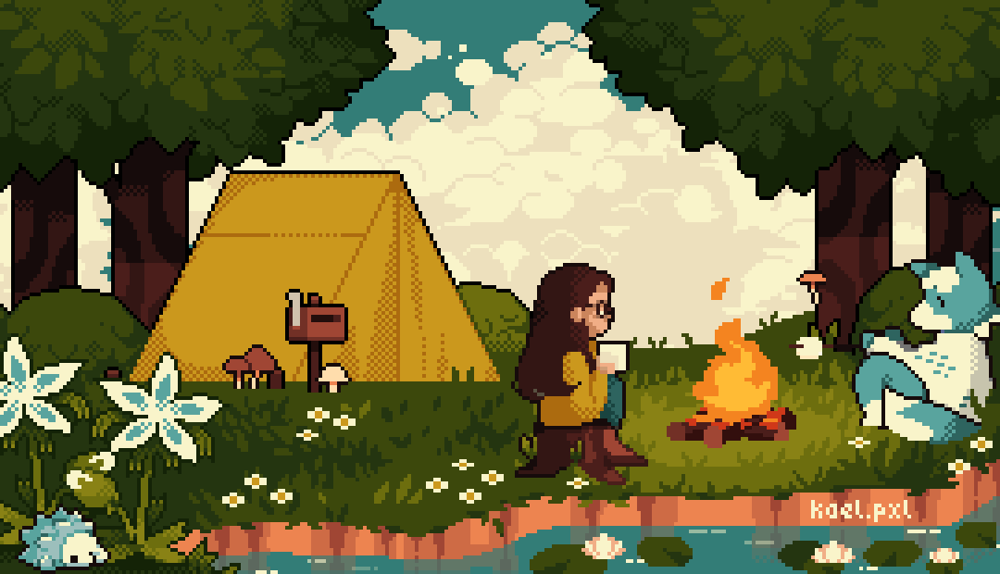

<h1 align="center">ok let's touch some grass 🌱</h1>

<p align="center">
  
</p>

---

## know about me

hey, i'm sahitya — a computer science engineering student who loves turning ideas into projects that solve real problems.

i enjoy building things that feel meaningful, whether it's backend systems, real-time applications, scalable platforms, or experimental ideas that started with a simple “what if?”.

most of the time you'll find me exploring new technologies, debugging something for hours, or thinking about the next thing i should build.

---

## what i do

- build software projects that solve practical problems
- explore backend systems and scalable architectures
- enjoy experimenting with real-time applications
- learn best by building, testing, and breaking things
- turn random ideas into actual working projects

---

## tech stack

```txt
languages     → python • java • c • javascript

backend       → node.js • express.js • fastapi • rest apis

frontend      → react.js • html • css

ai/ml         → pytorch • transformers • scikit-learn
                 opencv • librosa • ffmpeg

databases     → mongodb • mysql • redis

systems       → docker • kafka • apache spark • linux
                 distributed systems • realtime processing

tools         → git • github • firebase • ci/cd
```

---

## currently

- building projects from random late-night ideas
- probably thinking about the next thing to build already
- trying to make cool ideas actually work
- exploring systems that can handle real-world scale

---

## player stats

```txt
debugging patience      ████████░░
starting new ideas      ██████████
sleep schedule          ██░░░░░░░░
project tabs open       ██████████
coffee dependency       ███████░░░
fix one bug create two  ██████████
```
